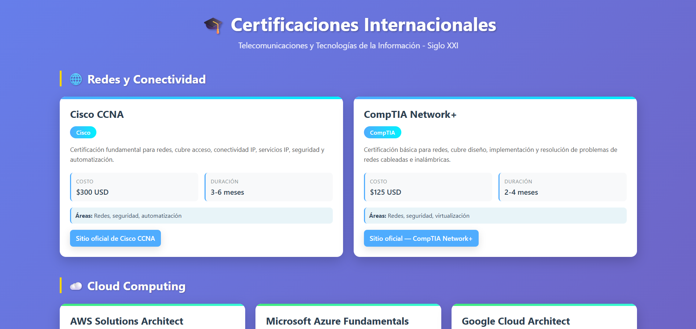

# Certificaciones-TI---Siglo-XXI

Repositorio con la infografía y recursos sobre certificaciones en Telecomunicaciones y Tecnologías de la Información. Contiene `cert-infografia.html`, íconos y recursos estáticos.

Autor: Jimmy David Cevallos Zambrano

## Vista previa

Captura de la infografía:

La imagen está en `screenshots/infografia-preview.png`.

